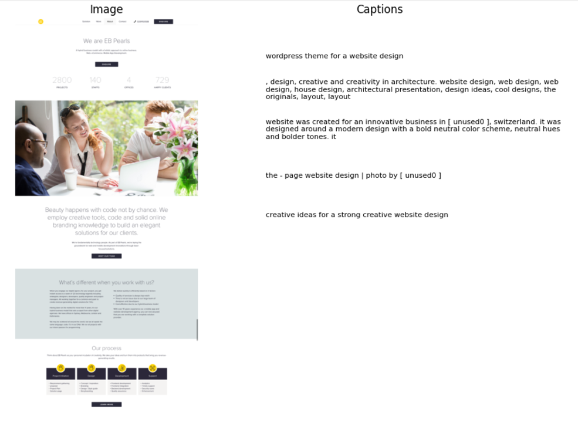
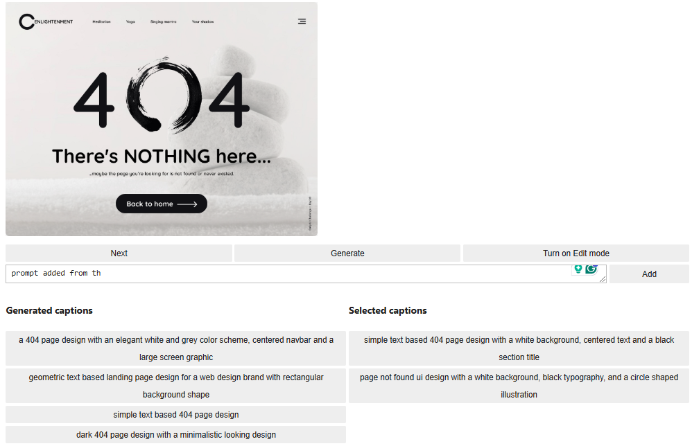

# From pixels to prompts: Streamlining Annotations with Image Captioning Models 


Annotating images for AI models can be a time-consuming and challenging task, especially when dealing with niche datasets. This project was created to address the need for a more efficient and scalable approach to image annotation, specifically for the **"Prompt-based AI-generated UI"** project. It explores an automated solution for image captioning, significantly speeding up dataset creation while improving the diversity and accuracy of annotations.



To achieve this, the following image captioning models have been fine-tuned:
- **[Git](https://huggingface.co/microsoft/git-base)**:  GenerativeImage2Text, base-sized 
- **[BLIP](https://huggingface.co/Salesforce/blip-image-captioning-large)** : Bootstrapping Language-Image Pre-training for Unified Vision-Language Understanding and Generation
- An ensemble of **[Git](https://huggingface.co/microsoft/git-large)**: GenerativeImage2Text, large-sized and **[ViT](https://huggingface.co/nlpconnect/vit-gpt2-image-captioning)**

These models were sourced from the **[HuggingFace image captioning model hub](https://huggingface.co/models?other=image-captioning)**, and a unique ensembling technique was applied to generate a variety of captions with different styles and visual details.

An intuitive interface was developed to streamline the captioning process, allowing users to easily navigate through images, select captions, edit them, and customize the generated prompts. This ensures that the captions are tailored to the specific needs of the AI models, enhancing the overall quality and diversity of the dataset.

## Features



- **Folder Navigation & Export:** Easily navigate through a folder containing images and generate customized annotation text files for each image.
- **Caption Generation:** Load fine-tuned image captioning models (Git, BLIP, Git + ViT ensemble) to generate and display diverse captions for each image.
- **Caption Filtering:** Filter out duplicates or similar captions using SentenceTransformer to streamline the selection of unique and relevant descriptions.
- **Interactive Caption Selection:** Select from a range of generated captions, customize them to meet specific requirements, and easily undo any selections to correct mistakes during the annotation process.
- **Custom Annotations:** Add custom annotations alongside the generated captions to further tailor and extend annotation capabilities for unique project needs.

### Installation 

1. Clone the repository and change directory

    ```bash
    git clone https://github.com/SaniaE/image-captioning.git
    cd path/to/repo/clone
    ```
2. Create and activate a new virtual enviornment

    ```bash
    python -m venv <environment_name>
    .\<environment_name>\Scripts\activate   # For Windows
    source <environment_name>/bin/activate  # For macOS/Linux
    ```
3. Add virtual environment to the Python Kernel 

    ```bash
    python -m pip install --upgrade pip 
    pip install ipykernel 
    python -m ipykernel install --user --name=<kernel_name>
    ```
4. Install dependencies

    ```bash
    pip install -r requirements.txt
    ```
5. Launch Jupyter Notebook 

    ```bash
    jupyter notebook

6. Open the notebooks: 
    - Open `Combining annotations.ipynb` to explore annotation creation 
    - Alternatively, open `Fine-tune image captioning model <model_type>.ipynb` to explore fine-tuning setup. 
    - Checkout the experiments folder to explore the experiments conducted during the project.

